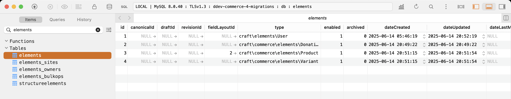

# Commerce Migration Debugging

- To debug, run the following. 
- Checkout `main` (Craft 4). 
- `ddev install`
- Create a sample product (the product type is already configured to be single Variant)
- Checkout the `craft-5` branch
- Run `ddev craft up` to update to Craft & Commerce 5
- Review the `elements` table, Variant's are missing `fieldLayoutId`

